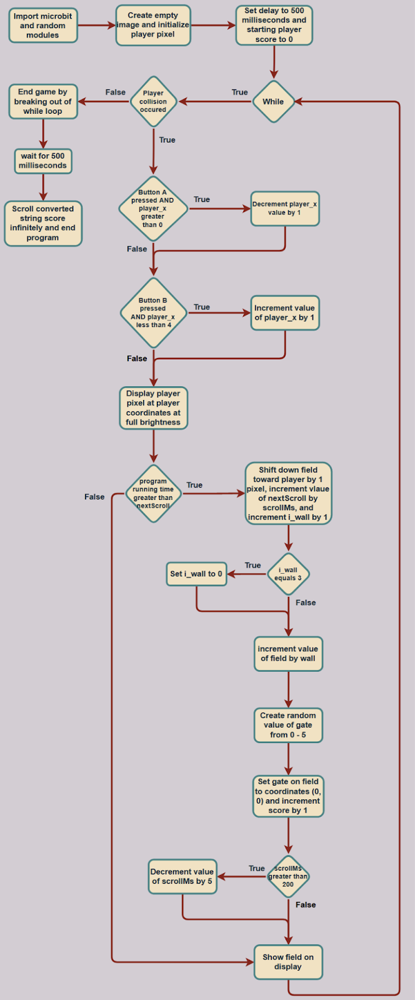

# Microbit_Graphical_Display
Lesson 11 of my Intro to Python course with Microbit

Program Overview: This program is a game made with python and a microbit. The player uses the buttons on the microbit to control a player pixel in a rage game. It is designed to be extra hard and make the player rage.

New Learnings: One new learning in this lesson is about creating a custom image. In this program, the field is a custom image created by lighting up one row of pixels. Although theoretically any custom image could be created by lighting up different pixels in an order. A player avatar could be created by lighting up the right pixels in the right order. This expanded the horizons on what is possible with the image() function.

Real-World Connections: One real-world connection made with this is animations. There are many animated T.V shows and movies and they all work on the same basis as this program. They show multiple images in quick succession at a constant rate. In this program the scrollMs value is like the framerate of the game, it controls how fast the game goes and therefore its difficulty. In animation each image has only a small difference from the first to simulate smooth motion, in this game, there is only one pixel of difference between each image as the images switch. Overall, this game uses classic animation techniques to make the motion seem natural.

Applications: One application for this program is in making an art display gallery program. Users can use the image() function to create their own pieces of art by lighting up certain pixels in an image. Then this image could be sent to one centralized microbit through the use of the radio module, the combination of pixels is just a string of numbers that can be sent through radio messages. Then the centralized microbit could compile all the images sent and allow its user to scroll through each image and simulate an art gallery. It’s a simple, fun, and easy way to share art and connect with other people.

